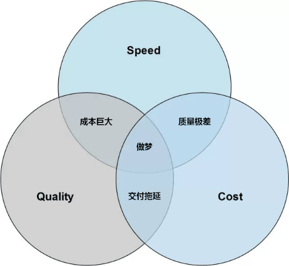
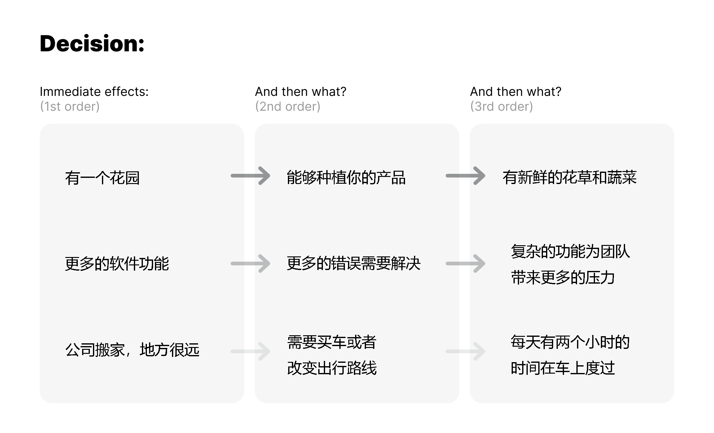
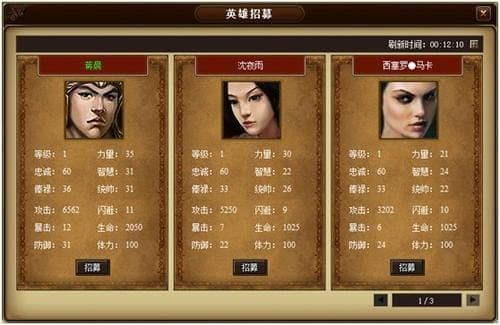
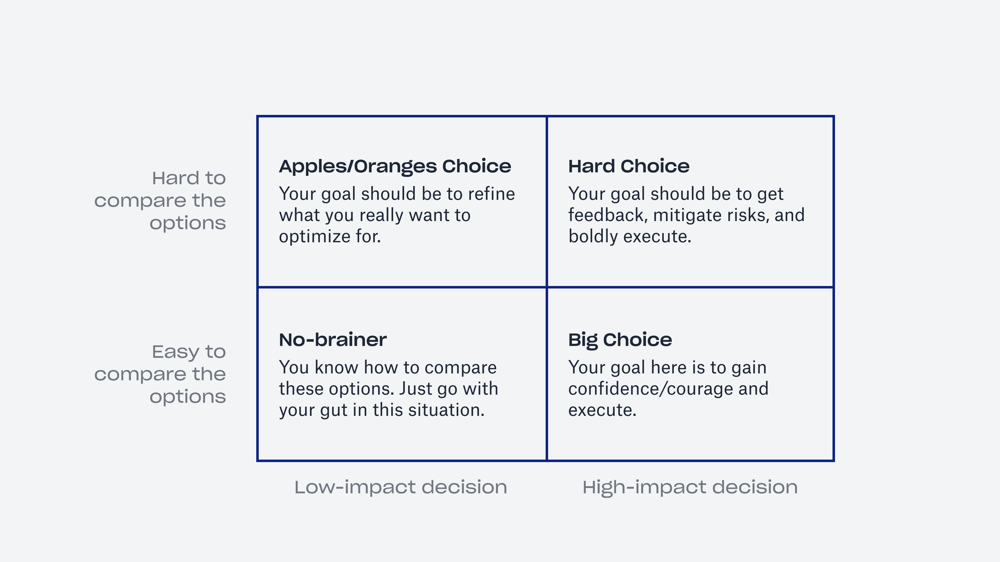
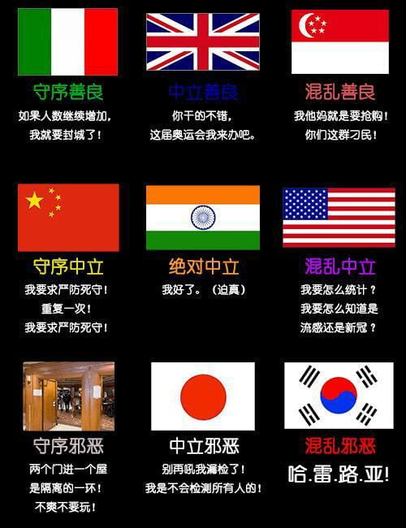
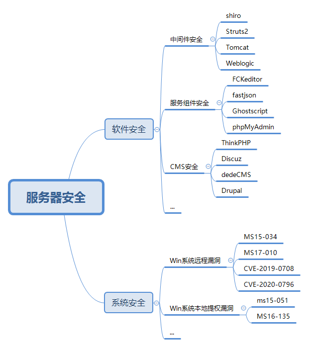
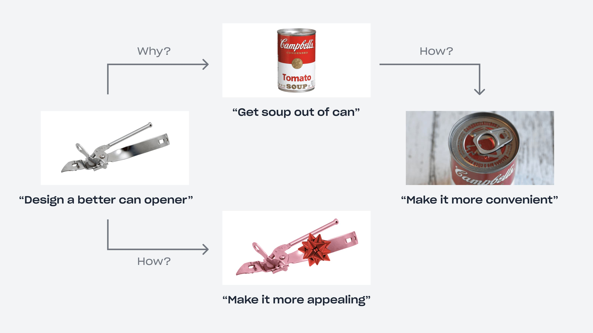

# Thinking-Plan

---

## 系统思维 - SYSTEMS THINKING

### 冰山模型 - Iceberg Model

> 通过观察抽象的隐藏层次，发现事件的根本原因。

冰山模型是一个工具，它可以让你改变你的视角，超越每个人都注意到的直接事件。它帮助你发现这些事件发生的根本原因。这可以通过观察系统内更深层次的抽象来实现，而这些抽象并不是一目了然的。

  

冰山模型通常将情境确定为四个基本层次.
- 事件(Events) - 代表了我们可以观察到的明显成分和行为
- 模式(Patterns) - 描述了随着时间推移的趋势
- 结构(Structures) - 描述了各部分是如何相互关联来影响模式的
- 思维模型(Mental models) - 通过一套信念、价值观和假设来支持系统中的其他一切，塑造人们的认知

冰山模型自上到下,越接近底层越是本质上的东西,也是越难感知到的东西。

冰山被用来比喻代表产生感知事件和问题的潜在结构，因为众所周知，冰山只有10%的总质量在水面上，而90%的质量在水下。用 "冰山一角 "这个说法来表示，人们所能看到的只是整个情况的一小部分，也就是说，在水面以下还有更多的东西,我们这个世界上正在发生的事情有很大一部分是被隐藏起来的，而冰山模型试图通过将其描述为一系列位于所观察到的日常现象下面的层次来明确这一点。

**事件**

水线以上的就是事件。事件是观察到多个变量的时间标记，它们是 "发生了什么 "或 "我们看到了什么"。

它们是关于系统中事物状态的离散活动或事实，就像注意到一台打印机坏了，意大利有了新总统，或者注意到有人开着一辆好车。如果我们把冰山模型应用于全球问题，我们可以说，在冰山的尖端，水面之上，是我们每天看到或听到的世界上发生的新闻或事件。

我们在新闻中听到的事件就代表了冰山一角。世界上大部分时间都是在事件层面度过的。这就是大部分人对世界的认知。

**模式**

模式是随时间变化的变量。它们是我们认为随着时间推移发生的趋势。

如果我们把目光投向水线以下，我们经常会开始看到模式或事件的反复出现。例如，这可能是反复发生的漏油事件，或者是一个人的电脑定期出现故障。又或者往往福利彩票的获奖者都喜欢cos米老鼠？为什么丈夫/妻子总是加班？

模式对于识别很重要，因为它们表明一个事件不是一个孤立的事件.`模式回答了这样的问题，什么一直在发生？或什么在改变？他们之间有什么关系？`

当我们做出 "冬天似乎变得更暖和了 "或 "汽油价格正在下降 "这样的陈述时，这些都是我们正在观察的模式，是事件之间的一系列`关系`。当我们到了模式层面，我们就可以进行预测、计划和预报。它让我们能够适应问题，从而更有效地应对问题。

**结构**

结构支持、创造并影响着我们在事件中看到的模式。结构可以理解为 `"游戏规则"`。它们可以是书面的，也可以是不成文的；它们可以是有形的，可以是可见的，也可以是不可见的。它们是规则、规范、政策、准则、权力结构、资源分配或非正式的工作方式，已被默示或明确地制度化。

它们回答了这样一个问题，即什么可以解释这些模式？

也许不容易看到结构，但我们能看到的模式告诉我们，结构一定存在。结构是由因果关系组成的。这些是模式之间的联系。

例如，一个农夫可能会说："如果我增加奶牛的数量，我就会得到更多的牛奶。" 她说的是奶牛数量的增加--一种模式--和牛奶数量的增加--另一种模式--之间存在着联系。

又或者,经常性的石油泄漏，可能是我们对化石燃料的依赖。但是，如果你看一看此类泄漏的`根本原因`，你就可以开始理解和解决长期的、可持续的解决方案，例如开发不依赖石油运输的替代能源。

**思维模型**

结构下面是思维模型。这些模型定义了创造结构的思维，然后表现为事件的模式。

思维模型是人们根深蒂固的假设和信念，它们最终驱动着人们的行为。思维模型是态度、信念、道德、期望、价值观或文化，它们使结构能够继续正常运行。这些是我们经常从社会或家庭潜意识中学习的信念，我们很可能不知道。

思维模型是结构得以继续运作的最终原因。它们是需要存在的思想和推理过程，以使结构成为现在的样子。这些想法存在于结构的利益相关者、建立结构的人或在结构运作方式中发挥作用的人的头脑中。思维模型通常很难识别，因为它们会产生许多从未明确说明的假设。

就比如中国的中庸之道，西方的契约精神,在长久的时间中影响着人的行为。

---

### 反馈循环 - Feedback loop

> 如果 A 导致了 B，B 也会导致 A(反馈, feedback)。.

反馈系统可以用来解释马太效应，也就是赢者通吃(Winner take all effect)。

- 第1年，你的产品比竞争者好1%，你比竞争者多获得了1%的用户。
- 反馈是，你获得了更多的收益，于是你有更多的资源改进你的产品。
- 第2年，你的产品比竞争者好2%，你比竞争者多获得了2%的用户。
- 反馈是，你获得了更多的收益，于是你有更多的资源改进你的产品。
- ...
- 最后，反馈循环会让竞争者退出市场，你获得了100%的用户。

---

- 如果B是一个正反馈，就形成了正反馈系统。
- 如果B是一个负反馈，就形成了负反馈系统。
- 于是，你可以配比不同类型的B，保持你的反馈系统的平衡(balancing loop)。

实际的生活中，反馈会发生延迟，系统的反馈循环会抖动，这就是真实的系统。

**平衡反馈循环 Balancing feedback loop**

平衡反馈循环是一种抵抗一个方向进一步变化的机制。它以相反方向的变化来抵消一个方向的变化。它的目的是稳定一个系统。

通常在系统中，你会发现这种平衡循环与正向反馈循环一起出现，后者的作用正好相反，会产生指数变化。

当平衡环路看到差距时，它将触发纠正行动，使某物的实际水平接近所需水平。

恒温器是平衡反馈循环的一个非常实用的例子。它监测房间内的温度（实际水平），当温度低于或高于某个阈值（所需水平）时，它将开始加热或冷却房间，以将温度保持在阈值内。

在这种情况下，整个循环是有意的，并设计了纠正行动。你还会发现很多自然的平衡循环。以茶叶的冷却为例。当你泡好茶后，将其静置，它将从最初的高温（实际水平）逐渐冷却，直到达到室温（所需水平）。在这种情况下，纠正的动作将是茶叶和周围空气之间的热传导。这将自然发生，背后没有任何意图。

**正向反馈循环 Reinforcing feedback loop**

只要循环内的行为或事件相互强化，就会发现正向反馈循环。这些循环会放大过程的效果。

你可以在身边找到现实世界的例子。复利是一个很常见的例子。你在银行里的钱越多，你赚的利息就越多。这些钱被加到你的余额中，所以你在利息上赚的更多。

强化反馈循环的效果是指数型的，而不是线性的。它们会导致指数级的增加或减少.

例如Facebook使用一个更好的信息流算法，给你呈现的东西是你喜欢的，你就会向朋友介绍Facebook，于是Fackbook获得了更多用户，更多用户可以带来更多收益，形成了正反馈系统。更多收益带来股东的更多信心，股价上升，重塑了(reinforcing loop)另一个反馈系统。更好的股价，吸引了更多投资和技术投入。这是一个正反馈。

---

### 关系环 - Connection circles

> 关系环是一种将故事或系统中的关系可视化的工具。它们通过看到系统中的因果关系来帮助你理解复杂性。

关系环是理解系统的一个重要工具。用于`识别关键元素并映射它们之间的关系`。这个工具也可以帮助你识别反馈循环。

现在的中小学生所研究的课题很复杂，往往难以理解。很少有一个问题像表面上看起来那么简单。也很少有一个问题会呈现出黑与白的选择。更多的时候，学生会在两个极端之间的灰色地带挣扎，比如。

- 杀虫剂可能带来的生态危害 是否值得增加作物产量和降低病害率的潜在好处？
- 咄咄逼人的外交政策是对好战国家的威慑，还是会造成更肥沃的战争氛围？
- 在一部小说中，我们可以从多个角度分析主人公的行为吗？

关系环可以帮助学生理解复杂性的思维工具。使用它们作为图形组织者，学生会产生关于系统内变化条件的想法。他们选择他们认为对变化最重要的元素，并画出箭头来追踪因果关系。通过这种方式，关系环帮助学生深入研究一个问题，并同时处理多个不同的想法。

在现实世界中使用的最为贴切的关系环应该是人脉关系图。

---

### 不做清单 - Not-To-Do list

> 不做什么决定了可以做什么。

你可能和大多数人一样会有 to-do 列表，你用它来帮助你集中精力完成事情，如果你没有，你可能也会想试着建立一个，因为它在心里上对你帮助很大，不过，not-to-do 列表也同样非常重要。

这个清单与todo 列表相辅相成，并且可能更加重要一些。

有时候，你选择不做什么，比你绝对做什么更重要。通过减少一种行为，你实际上是在增加另一种行为，你会创造一个空白的时间段，需要通过某种形式来填充，通过限制某些活动，你实际上是在给自己机会，让你完全专注于最重要的方面，有太多的自由会有不利的一面。

---

## 决策制定 - DECISION MAKING

### 速度质量成本关系

---

### 二阶思维 - Second-order thinking

> 考虑你的决策的长期后果。

有些决定一开始似乎是赢了，但随着时间的推移，却变成了亏损。现在看来是投资的东西，后来却变成了负债。早先看起来是好的决定，现在却变成了坏的决定。二阶思维是一种工具，可以帮助你审视决策的长期影响。

大多数人都停留在一阶思维上。要做出经得起时间考验的决定，二阶思维是必要的。我们需要确保我们今天的决定可以接受更多的长期后果。

考虑一个你必须做出的决定。先看看做出这个决定的最直接的影响--第一顺序。

然后针对每一个效果问自己："然后呢？"然后呢？" 这就是你如何考察这个决定的第二阶后果。你可以重复这样做，只要你觉得实际可行，就可以查看更多的顺序。

或者，在不同的时间线中思考这个决定。问自己： 这个决定会有什么后果？
- 十分钟？
- 10个月？
- 10年？

这样你就可以思考你的决定的短期、中期和长期后果。

你可以将二阶思维应用于大的决策（如买房），也可以应用于小的、看似平凡的决策（如吃蛋糕）。这是一个非常通用的工具，不仅在个人生活中，而且在商业或决策中也有意义。

直接的影响可能是拥有一个花园，为你的家人提供更多的空间，但也突然住在离工作一小时的地方。

---

### 决策矩阵 - Decision matrix

> 考虑多种因素，选择最佳方案。

有些决定是很难做的。尤其是当做决定的因素比较多的时候。决策矩阵是一个工具，它可以帮助你在做决定时考虑所有的重要因素。它能让这个过程更加清晰。

当你有几个选择，而你需要根据一些不同的因素在它们之间做出决定时，它是最有用的。

现实中一个很好的简化例子就是网络游戏里的英雄招募页面

---

### 选择模型 - choice model

> 弄清楚自己在做一个什么样的决定。

选择模型可以帮助你看清你正在做的是什么样的决定--是不费吹灰之力，还是艰难的选择，还是介于两者之间。它将使你能够推进你的决定。

  

在现实中往往情况复杂的多,4种情况不好归类,具有精髓的例子就是阵营九宫格。

---

### 沉没成本 - Sunk Cost

> 沉没成本是指已发生或承诺、无法回收的成本支出，如因失误造成的不可收回的投资。

举例来说，如果某人预订了一张电影票，已经付了票款且假设不能退票。此时付的价钱已经不能收回，就算不看电影钱也收不回来，电影票的价钱算作沉没成本。

随着电影的播放，你发现电影非常难看，简直就是在浪费你的时间，但是你觉得应该要值回票价，所以还是觉得看完剩下的2小时，这个绝对考虑的是之前10元损失，但这不是最佳决定，更符合逻辑的行为是：当你意识到这部电影并不是你想看的，就应该起身离席，这样你只浪费10元和15分钟，而不是10元和2小时，那不是更好吗？

如果你能早早离开，你本来能够拥有额外的2小时，这种思考就是基于未来的收益，你花掉的10元已经消失或沉没了，无论你看不看剩下的电影，也没法挽回，这就是沉没成本误区的原理，所以我们通常浪费资源做某事，即使毫无益处，也更愿意坚持下去，这不仅体现在金钱上，时间和精力也是如此。

---

## 问题处理 - PROBLEM SOLVING

### Issue trees

> 系统地组织和解决问题。

Issue 树基本上是问题的地图。它们为你提供了一种清晰而系统的方法来看待你需要解决的问题。它们帮助你把一个大问题分解成更小的、更容易处理的问题，并对问题的某些部分进行优先处理。换句话说，它们对 "分而治之 "的策略很有用。

问题树也是与他人交流问题的好帮手，因为它们提供了问题的地图。

在实际使用中，也常常称为思维简图,逻辑图等。

---

### 抽象阶梯式 - Abstraction laddering

> 用不同的抽象层次更好地框定你的问题。

抽象梯形图是一种更巧妙地构架问题的工具。它有助于更清晰地定义一个你需要解决的问题。它帮助你超越最初的问题陈述。

这个工具为你提供了提出正确问题的能力，使你能够在阶梯上上下移动。

他从最初的问题陈述开始。"设计一个更好的开罐器" 最初问 "怎么做？"，他就会得到一个更具体的陈述 "让它更吸引人"。

但他也可以往上走："为什么我们需要一个更好的开罐器？"

这样他就会得到更抽象的问题陈述。"把汤从罐头里拿出来" 从那里，他可能会问："我们怎样才能把罐头里的汤弄出来？"。这样就可以定义一个不同的问题陈述 "让它更方便".

---

**Source & Reference**
- [Tools for better thinking | Untools](https://untools.co/)
- [Iceberg Model - Systems Innovation](https://systemsinnovation.io/iceberg-model/)
- [心智与认知(1): 反馈循环(Feedback loop) ](https://www.cnblogs.com/math/p/cognition-001.html)
- [沉没成本如何影响你做决定？](https://www.bilibili.com/video/BV1kZ4y1u7wn)
- [为什么不要做事务清单很重要？](https://www.bilibili.com/video/BV1vv411q7L3)
