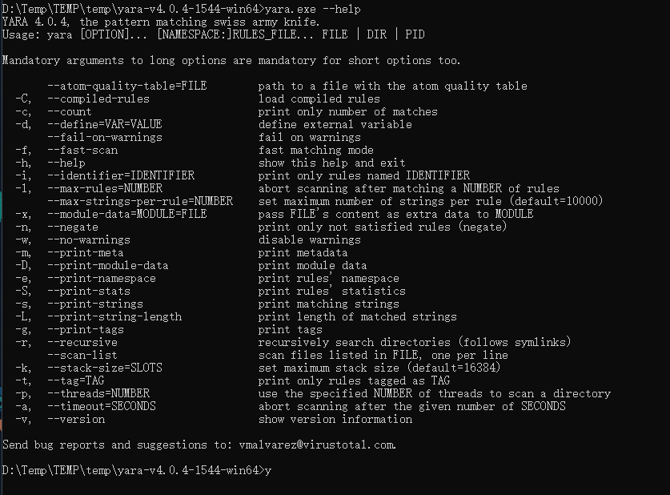
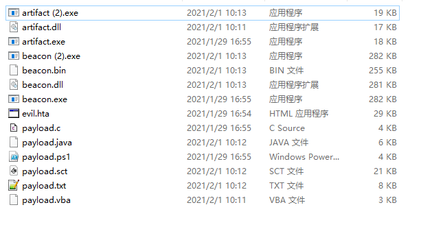
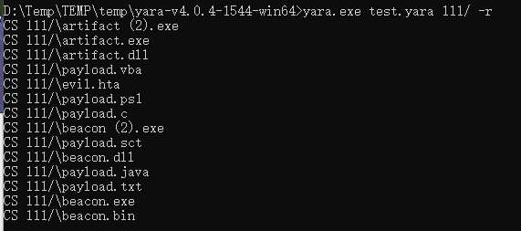
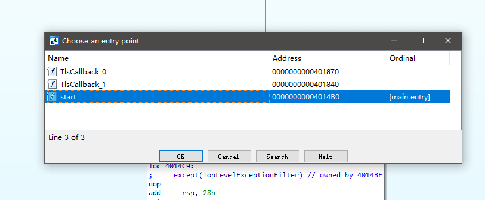
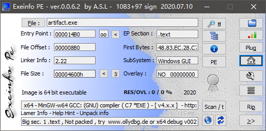
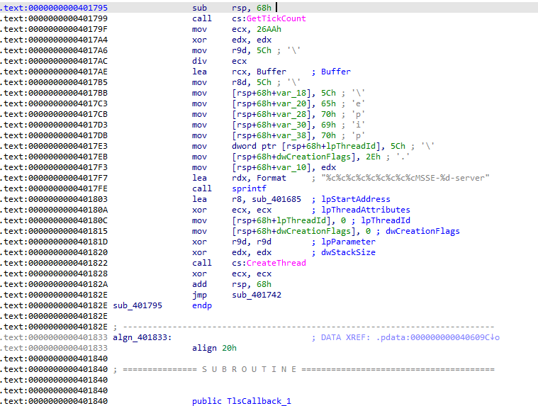
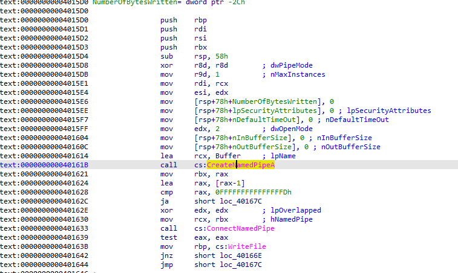
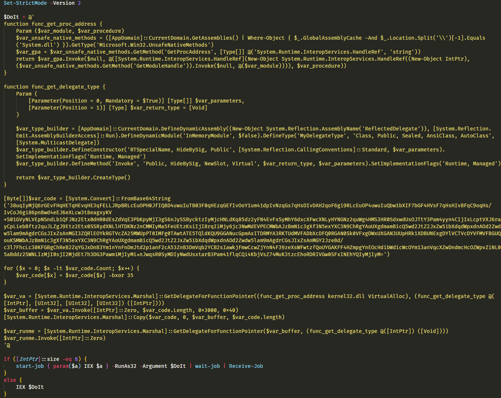
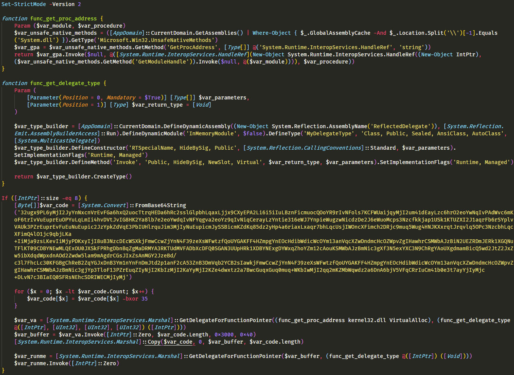
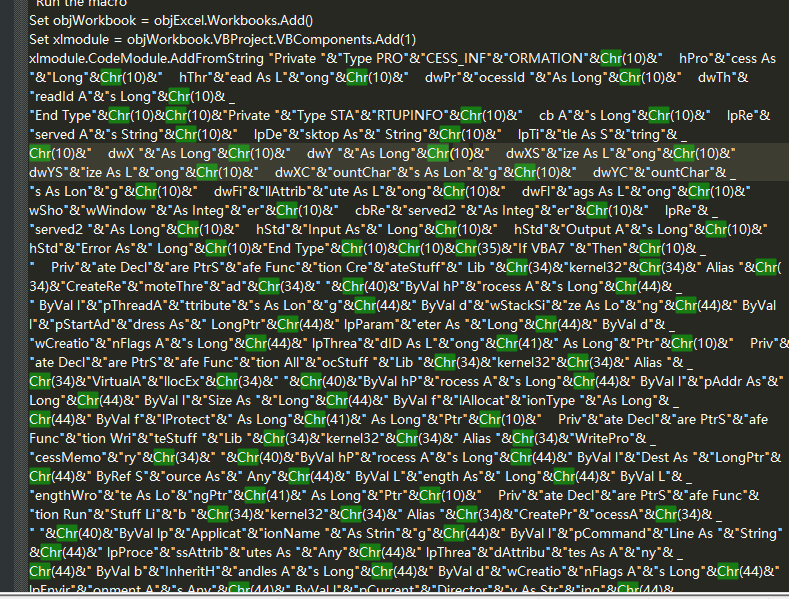

# yara 实验

---

## 免责声明

`本文档仅供学习和研究使用,请勿使用文中的技术源码用于非法用途,任何人造成的任何负面影响,与本人无关.`

---

## 什么是 yara

YARA 是一款旨在帮助恶意软件研究人员识别和分类恶意软件样本的开源工具，使用 YARA 可以基于文本或二进制模式创建恶意软件家族描述信息，当然也可以是其他匹配信息。

这款工具配备一个短小精悍的命令行搜索引擎，它由纯Ｃ语言编写，优化了执行的效率。该引擎可以跨平台使用，能够运行 Windows,Linux 及Ｍac OS X 系统上。同时，这款工具提供 python 扩展，允许通过 python 脚本访问搜索引擎。

YARA 的功能非常丰富，尤其是与模块的集成。模块可以在保持规则可读性的基础上开启了非常精细的扫描。

---

## 安装

linux 下可以直接用包管理器进行安装
```bash
apt install -y yara
```

windows 下访问项目的 releases 页面下载 https://github.com/VirusTotal/yara/releases

为了方便,这里重命名 yara64.exe 为 yara.exe

在当前目录下打开 CMD, 输入 help
```
yara.exe --help
```




---

## 语法

```
       --atom-quality-table=FILE        path to a file with the atom quality table
  -C,  --compiled-rules                 加载已编译的规则
  -c,  --count                          只打印匹配的数量
  -d,  --define=VAR=VALUE               定义外部变量
       --fail-on-warnings               警告失败
  -f,  --fast-scan                      快速匹配模式
  -h,  --help                           显示此帮助并退出
  -i,  --identifier=IDENTIFIER          print only rules named IDENTIFIER
  -l,  --max-rules=NUMBER               匹配多个规则后中止扫描
       --max-strings-per-rule=NUMBER    设置每条规则的最大字符串数（默认=10000）
  -x,  --module-data=MODULE=FILE        pass FILE's content as extra data to MODULE
  -n,  --negate                         仅打印不满足的规则 (negate)
  -w,  --no-warnings                    禁用警告
  -m,  --print-meta                     打印元数据
  -D,  --print-module-data              打印模块数据
  -e,  --print-namespace                打印规则的名称空间
  -S,  --print-stats                    打印规则的统计信息
  -s,  --print-strings                  打印匹配的字符串
  -L,  --print-string-length            打印匹配字符串的长度
  -g,  --print-tags                     打印标签
  -r,  --recursive                      递归搜索目录(遵循符号链接)
       --scan-list                      扫描FILE中列出的文件，每行一个
  -k,  --stack-size=SLOTS               设置最大堆栈大小（默认=16384）
  -t,  --tag=TAG                        只打印标记为TAG的规则
  -p,  --threads=NUMBER                 使用指定的线程数来扫描一个目录
  -a,  --timeout=SECONDS                在给定的秒数后中止扫描。
  -v,  --version                        显示版本信息
```

---

## 示例

**基本使用**
```
rule silent_banker : banker
{
    meta:
        description = "This is just an example"
        thread_level = 3
        in_the_wild = true
    strings:
        $a = {6A 40 68 00 30 00 00 6A 14 8D 91}
        $b = {8D 4D B0 2B C1 83 C0 27 99 6A 4E 59 F7 F9}
        $c = "UVODFRYSIHLNWPEJXQZAKCBGMT"
    condition:
        $a or $b or $c
}
```

- 第一行的 rule silent_banker : banker 是声明该规则用于检出 banker 类型的样本。
- meta 后面的是一些描述信息，比如规则说明、作者信息等。
- strings 定义了 $a $b $c 两个十六进制字符串（十六进制字符串用大括号括起来）和一个文本字符串（文本字符串直接用双引号括起来）
- condition 规定了匹配的条件，这里写的是 or，表明样本中只要匹配到了 $a $b $c 三个字符串中的任意一个，那么样本就会被识别为 banker

新建一个 test.yara,内容同上,同时新建一个文件夹,文件夹中随机复制几个文件进去,进行识别
```
yara.exe test.yara 111/
```


没有任何反应, 因为我们的 yara 规则没有命中 111 文件夹下的任何文件。

修改下规则
```
rule silent_banker : banker
{
    meta:
        description = "This is just an example"
        thread_level = 3
        in_the_wild = true
    strings:
        $a = {6A 40 68 00 30 00 00 6A 14 8D 91}
        $b = {8D 4D B0 2B C1 83 C0 27 99 6A 4E 59 F7 F9}
        $c = "UVODFRYSIHLNWPEJXQZAKCBGMT"
        $d = {4D 5A}
    condition:
        $a or $b or $c or $d
}
```

增加了一个十六进制字符串 $d 所匹配的值是 4D 5A。 而 4D 5A 是 PE 文件（包括 exe、dll 等）的文件头，也就是说一个正常的 PE 文件中是一定会包含 4D 5A 这个十六进制的数据的。

且我们在最后的 condition 中加入了 or $d，表示如果 $d 条件满足，样本也可以成功识别。

重新对111文件夹下的文件进行扫描


这里识别了多个文件，并命中自定义的 yara 特征。

如果要识别子目录下的文件需要 -r 参数

**识别 python**

新建 test.yara
```
rule python_test : python
{
    strings:
        $a="if __name__ == '__main__':" nocase
    condition:
        $a
}
```

nocase 关键字代表不区分大小写

测试


---

## 匹配 CS

### Win32_PE

这里生成多个 cs 马,分析提取一些特征。



可以看到大小区分的比较明显,要么 20kb 以下,要么 300kb 以下,这是因为小的是 Staged 大的是 Stageless。

yara 规则是会全文扫描的，那么这样将会大大降低扫描效率，如果我们能够写一些 filter 过滤掉大部分的不相关样本，那么 yara 在扫描的时候将会只对疑似的文件进行有效的扫描而不会浪费资源。

那这里可以过滤文件大小
```
rule CS : win32
{
    condition:
        filesize < 400KB
}
```



用 IDA 分析2个exe

来到 start 函数之后，我们可以发现多个 CobaltStrike 样本的入口点是完全一致的，程序入口点都是 004014B0




用 exeinfo pe 获取入口点,需要注意的是，这里是获取到的文件偏移，也就是offset，并不是我们在IDA中看到的entry_point




使用pe.entry_point来获取入口点
```
import "pe"

rule CS : win32
{
    condition:
        pe.entry_point == 0x8b0 and filesize < 400KB
}
```


接下来继续找特征,静态查看 main 函数


这里调用了 sub_402A60 和 sub_401795 ,跟进查看,这里 sub_401795 比较关键



在 sub_401795 函数中，程序会通过 CreateThread 创建一个新线程

并且可以看到有一个 `%c%c%c%c%c%c%c%c%cMSSE-%d-server` 看起来像是通信协议。

这里 CreateThread 的 lpStartAddress 是 sub_401685, 在 sub_401685 的 sub_4015D0 函数中可以看到通过 CreateNamedPipeA 的方式创建管道准备通信。




那么接下来直接匹配这个字符串
```
import "pe"

rule CS : win32
{
    strings:
        $comm="%c%c%c%c%c%c%c%c%cMSSE-%d-server"
    condition:
        pe.entry_point == 0x8b0 and filesize < 400KB and $comm
}
```


最后再加上一个 PE 文件的判断
```
import "pe"

rule CS : win32
{
    strings:
        $comm="%c%c%c%c%c%c%c%c%cMSSE-%d-server"
    condition:
        uint16(0)==0x5A4D and pe.entry_point == 0x8b0 and filesize < 400KB and $comm
}
```

---

### powershell

生成不同位数下的 powershell 后门


32位



64位



32 位和 64 位结构相似, 32 位使用 $DoIt = @''@方式定义两个函数. 程序关键执行的内容被 base64 编码

比较相似的就是这个 `[Byte[]]$var_code = [System.Convert]::FromBase64String`

匹配这种类似的字符串
```
rule powershell
{
    strings:
        $string1="[Byte[]]$var_code = [System.Convert]::FromBase64String"
        $string2="$var_runme.Invoke([IntPtr]::Zero)"
    condition:
        filesize < 20KB and $string1 and $string2
}
```


---

### html_pe

CobaltStrike 提供 3 种生成 html 木马的方式 exe,powershell,vba,依次生成如下


**exe**


简单粗暴,直接包含一个 PE 文件在其中，


文件最后将 shellcode 释出为 evil.exe 并执行，这里文件名不一定是固定值,尝试通过正则进行匹配。

```
rule html_exe
{
    strings:
        $string="evil.exe"
        $string2="var_shellcode"
        $reg1= /var_tempexe = var_basedir & \"\\\" & \"[A-z]{1,20}.exe\"/
    condition:
        filesize < 100KB and $string and $string2 and $reg1
}
```


**vba**

查看 vba 版的html马


中间一大段为混淆的 vba 代码



通过 & 符号拼接由 chr 函数转换的 ascii
```
&Chr(10)&
```

这里比较容易找到特征,比如 myAr"&"ray


```
rule html_vba
{
    strings:
        $string="Wscript.Shell"
        $string2= "myAr\"&\"ray \"&Chr(61)&\" Array\"&Chr(40)&Chr(45)&\"4\"&Chr(44)&Chr(45)&\"24\"&Chr(44)&Chr(45)&"
    condition:
        filesize < 100KB and $string and $string2
}
```


**powershell**

查看结构


同样的 base64 编码命令, 解码查看


这里 $s=New-Object IO.MemoryStream 结合下文是将数据加载到内存中执行

> 在 cs3.14中是$s=New-Object IO.Memor

```
rule html_ps
{
    strings:
        $string= "Wscript.Shell"
        $string2= "var_shell.run \"powershell -nop -w hidden -encodedcommand"
        $string3= "var_func"
    condition:
        filesize < 100KB and $string and $string2 and $string3
}
```


---

## Source & Reference

- [Yara入门——如何通过Yara规则匹配CobaltStrike恶意样本](https://www.anquanke.com/post/id/211501)
