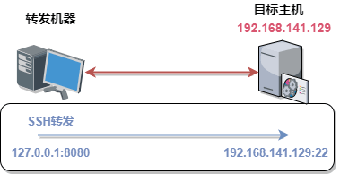
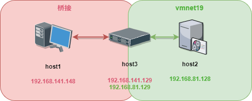
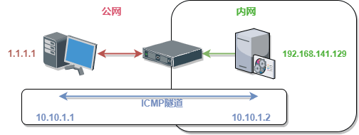

# 隧道实验

---

## 免责声明

`本文档仅供学习和研究使用,请勿使用文中的技术源码用于非法用途,任何人造成的任何负面影响,与本人无关.`

---

## 应用层

### WEB隧道

- [sensepost/reGeorg](https://github.com/sensepost/reGeorg)
- [L-codes/Neo-reGeorg](https://github.com/L-codes/Neo-reGeorg)

### SSH隧道

**相关文章**
- [SSH端口转发（本地转发、远程转发、动态转发）](https://www.cnblogs.com/zangfans/p/8848279.html)
- [「端口转发」SSH 隧道](https://ai-sewell.me/2018/%E7%AB%AF%E5%8F%A3%E8%BD%AC%E5%8F%91-SSH-%E9%9A%A7%E9%81%93/)
- [内网穿透-ssh转发技术](https://mp.weixin.qq.com/s/JgoHWE0Egfi_oSLoOEVwzg)

**语法参考**
```bash
ssh -L 8080:127.0.0.1:80 root@192.168.1.7       # 本地转发
ssh -R 8080:127.0.0.1:80 root@192.168.1.7       # 远程转发
ssh -D 1080 root@sshserver                      # 动态端口转发
```

**参数含义**
```
-C 压缩传输，增加传输的效率
-f 将 SSH 传输放在后台执行
-N 建立静默连接，就是建立了连接
-g 允许远程主机连接本地用于转发端口
-L 本地端口转发
-R 远程端口转发
-D 动态转发
-P 指定 SSH 的端口
```

#### 本地端口转发

**测试实验**

将发送给本地的请求通过 ssh 隧道转发给目标端口，我们可以实现访问本地端口来访问目标端口的信息

```bash
ssh -CfNg 用户名@ssh机器IP -L 本地端口:目标主机:目标主机端口
```



```bash
ssh -fN root@192.168.141.129 -L 8080:127.0.0.1:22
```


此时访问转发机器的 8080 口，从而转发到目标机器的 22 端口


---



如下这个场景,我现在 host3 上起转发
```bash
ssh -fN root@192.168.81.128 -L 8080:0.0.0.0:22
```

这个时候 host3 访问自己的 127.0.0.1:8080 可以到 192.168.81.128

但是 host1 访问 192.168.141.129:8080 是不行的

需要 host2 监听 0.0.0.0
```bash
ssh -fN root@192.168.81.128 -L 0.0.0.0:8080:0.0.0.0:22
```

这样 host1 访问 192.168.141.129:8080 就可以到 192.168.81.128:22

#### 远程端口转发

**测试实验**

将远程主机端口的请求通过 ssh 隧道转发给本地主机的端口

```bash
ssh -CfNg user@ssh机器IP -R <远程ip>:<远程端口>:<目标ip>:<目标端口>
```


在 B 上

```
ssh -CfNg root@1.1.1.1 -R 0.0.0.0:8080:0.0.0.0:22
```

现在 A 访问 127.0.0.1:8080 就可以访问到 192.168.141.148:22 了

不过其他主机访问 A 的 8080 都是访问不了的,这种情况下 ssh 不支持 0.0.0.0 监听

#### 动态端口转发

**测试实验**

本地和远程转发只能一对一端口转发，想访问别的端口还需要重新设定转发，所以有了动态转发

动态端口转发是只绑定一个本地端口，目标地址端口不固定，而是根据我们的请求决定。其实在这里 SSH 就是创建了个 SOCKS 代理服务
```
ssh -CfNg 用户名@ssh机器IP -D <本地ip>:<本地端口>
```


在 host1 上

```
ssh -CfNg root@1.1.1.1 -D 127.0.0.1:1080
```

这时候 host1 主机的 1080 就是个 socks 代理，浏览器设置代理或设置全局代理后，就可以访问 host3、host4 内网主机了。

---

## 网络层

### ICMP

**相关文章**
- [ICMP隐蔽隧道从入门到精通](https://www.anquanke.com/post/id/152046)
- [内网穿透-ICMP协议](https://mp.weixin.qq.com/s/ZA6NlOg5SXggBLgk7ClUfA)

#### icmptunnel

**项目地址**
- [DhavalKapil/icmptunnel](https://github.com/DhavalKapil/icmptunnel)

**测试实验**

拓扑环境如下：



我这里就假设 vps 为 1.1.1.1 了

先配置环境,vps和内网机器上都安装上 icmptunnel,步骤是一样的
```bash
git clone https://github.com/DhavalKapil/icmptunnel.git
cd icmptunnel && make
```

然后在2台机器上都禁用 icmp
```bash
sysctl -w net.ipv4.icmp_echo_ignore_all=1
echo 1 > /proc/sys/net/ipv4/icmp_echo_ignore_all
```

vps 作为主机,监听
```bash
./icmptunnel -s
ctrl-z
bg
```

这时候会创建一个 tun0 ,给他分配一个内网地址
```
ifconfig tun0 10.10.1.1 netmask 255.255.255.0
```

然后再内网机器上启动
```
./icmptunnel 1.1.1.1
ctrl-z
bg
```

同样的 tun0 ,给他分配一个内网地址
```
ifconfig tun0 10.10.1.2 netmask 255.255.255.0
```

这个时候可以在 vps 上测试
```
ssh root@10.10.1.2
```

速度会有点慢,如果没有出错就可以连接了
