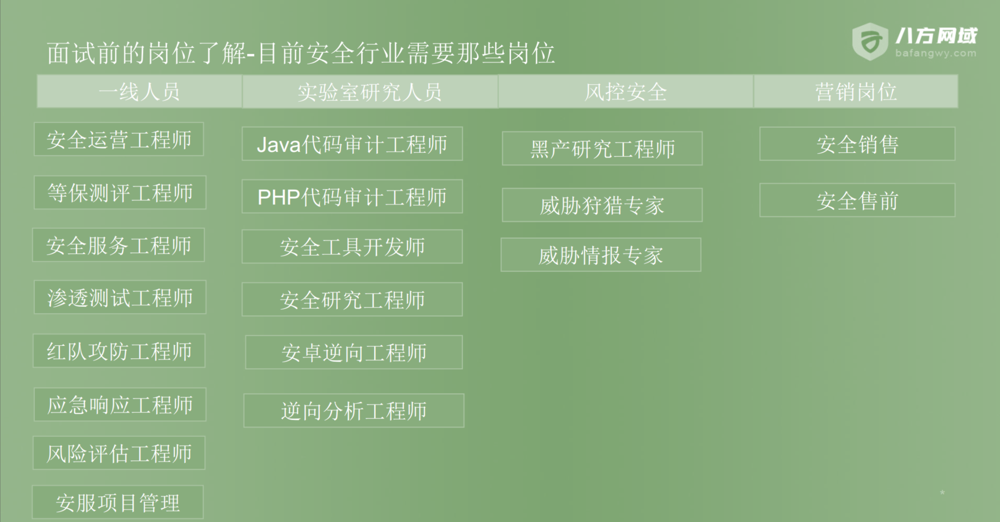
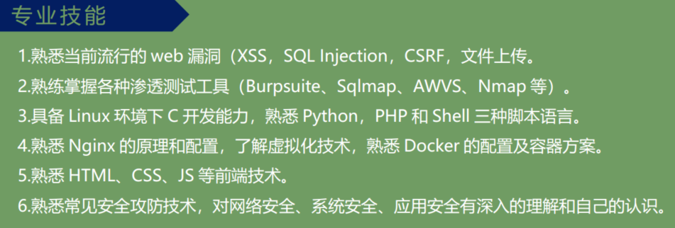
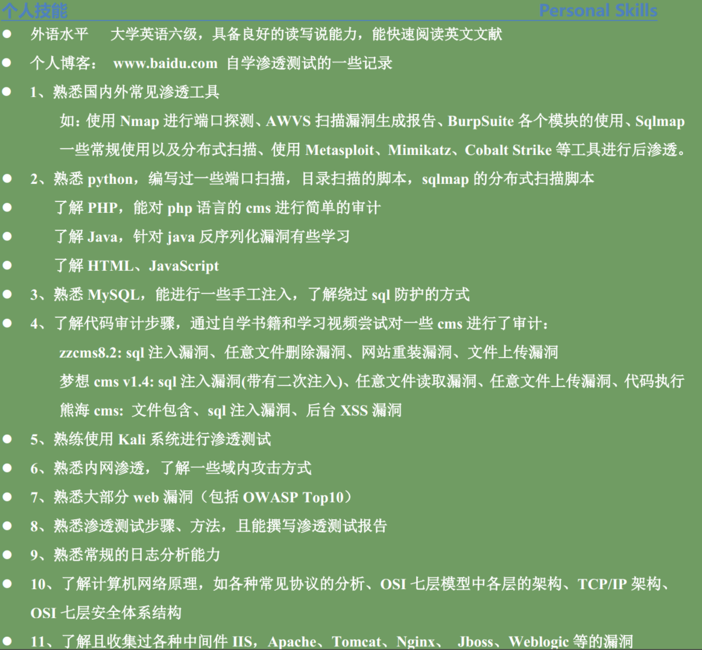
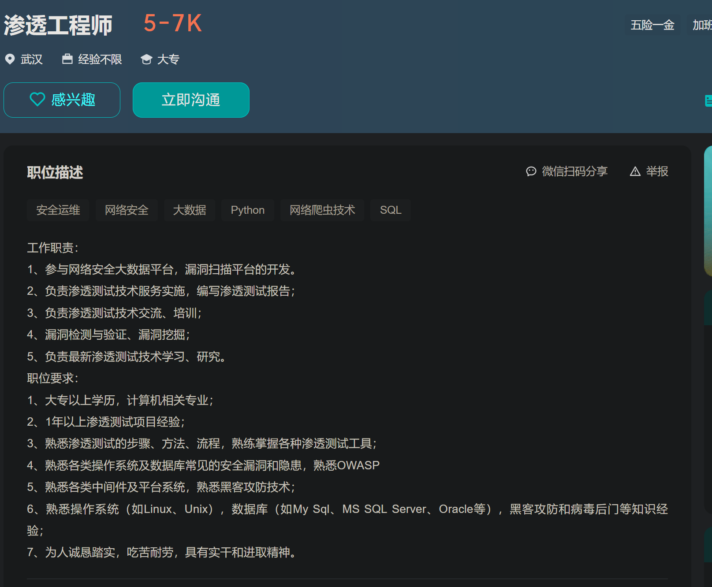
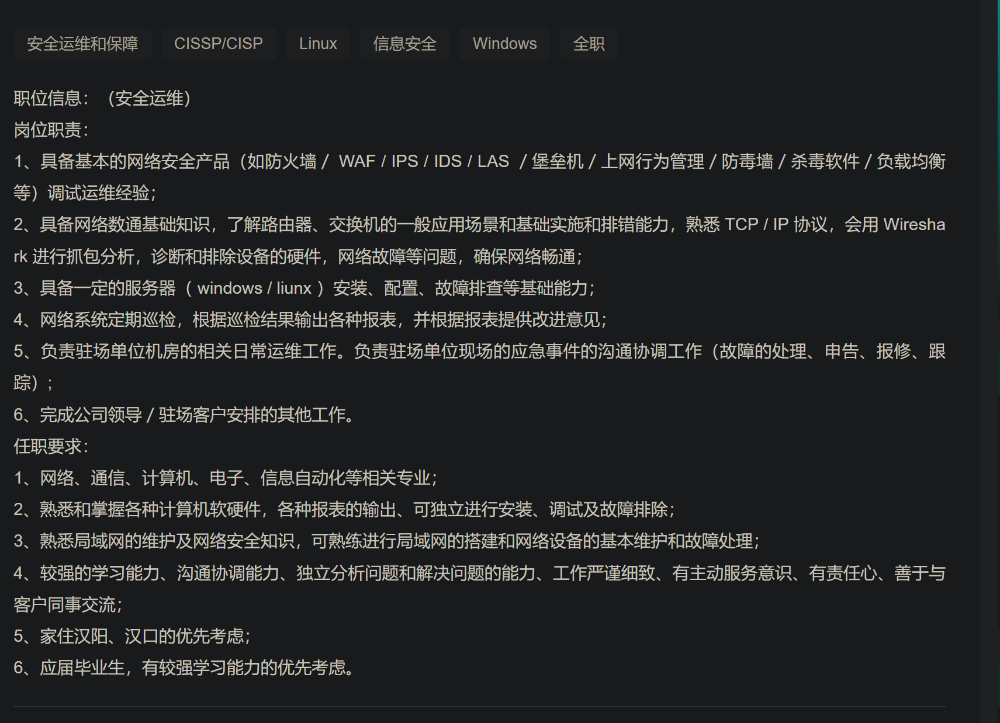
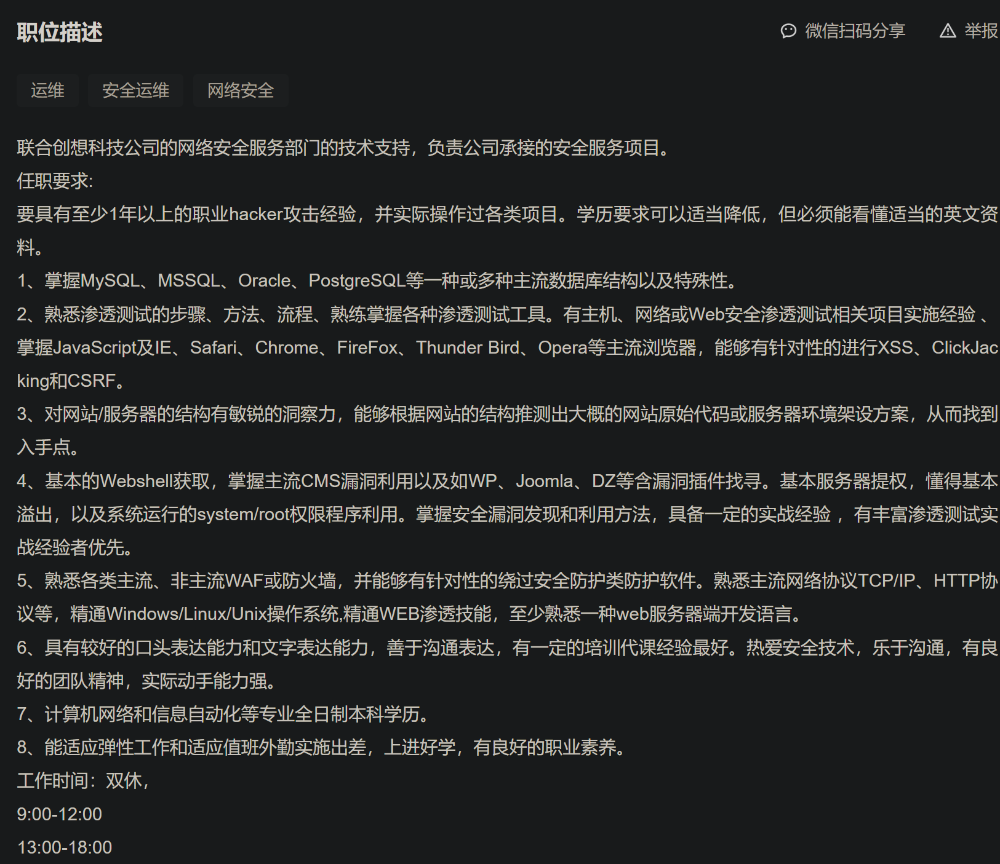
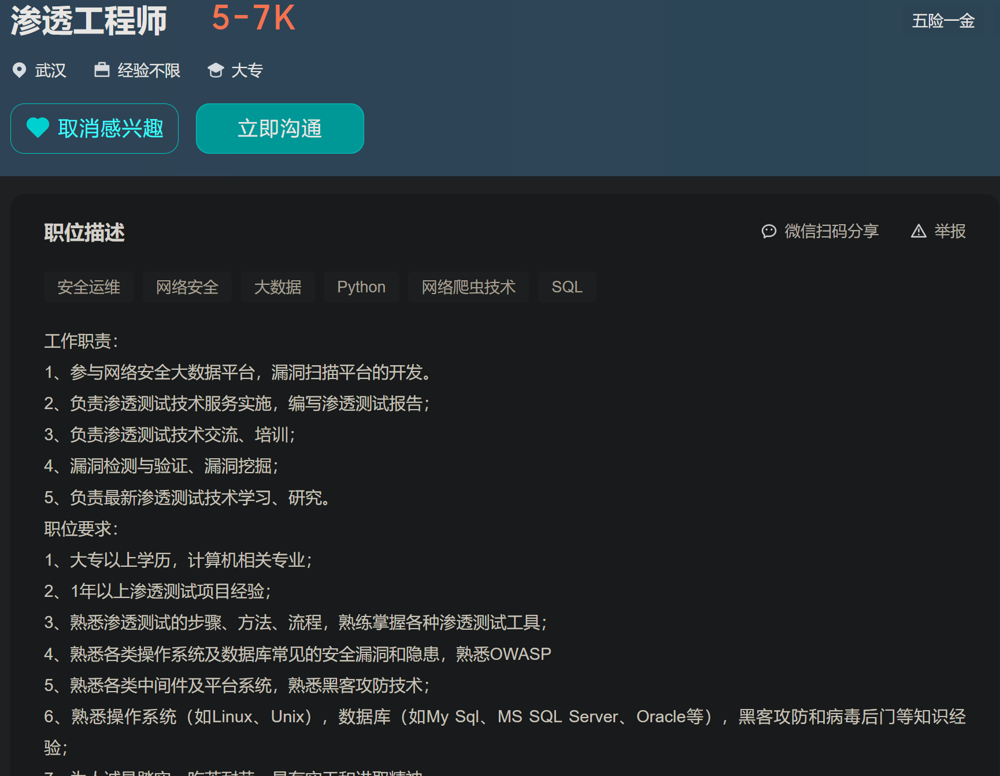

#  学习方向（面向招聘）

 ## 岗位

  ### 易于入行和就业面专业的最多的

#### 安全运营工程师
> - 漏洞分析能力 流量分析能力 研判 设备

  #### 等保测试工程师 
> - 漏洞分析 等保是干嘛

#### 渗透测试工程师
> -  外围打点能力(信息收集能力)、漏洞挖掘能力、漏洞分析能力

####  代码审计(php和Java类的) 钱多
> -  代码的编程能力   代码审计 漏洞分析

  #### 应急响应
> -  流量分析 入侵排查 日志分析

## 学习重点权重上安排
#### OWASP
截止到我的最后更新时间（2022年初），OWASP（开放式网络应用安全项目）发布的十大最新漏洞包括：

1. **注入（Injection）：** SQL、NoSQL、OS命令注入等。攻击者通过向应用程序的数据库发送恶意数据来执行任意的数据库指令。

2. **身份验证 (Broken Authentication）：** 包括密码泄露、会话管理问题、跨站点请求伪造（CSRF）等，导致身份验证和会话管理系统受到攻击。

3. **敏感数据暴露（Sensitive Data Exposure）：** 未加密或弱加密的敏感数据可能被攻击者窃取，如信用卡信息、个人身份信息等。

4. **XML外部实体（XML External Entities, XXE）：** 攻击者利用XML解析器的功能来执行恶意代码，可能导致敏感信息泄露、服务器端请求伪造等问题。

5. **无效的访问控制（Broken Access Control）：** 未正确实施的访问控制机制，可能导致未经授权的用户访问敏感功能或数据。

6. **安全配置错误（Security Misconfiguration）：** 指的是安全设置不当，如默认密码、错误的文件权限等，使得攻击者可以利用这些错误进行攻击。

7. **跨站脚本（Cross-Site Scripting, XSS）：** 攻击者向应用程序注入恶意脚本，使得用户在浏览时执行这些脚本，可能导致信息窃取、会话劫持等问题。

8. **不安全的反序列化（Insecure Deserialization）：** 反序列化操作不当可能导致攻击者执行任意代码，造成拒绝服务、远程代码执行等风险。

9. **使用具有已知漏洞的组件（Using Components with Known Vulnerabilities）：** 应用程序中使用的第三方组件存在已知的漏洞，攻击者可能利用这些漏洞进行攻击。

10. **不足的日志记录和监控（Insufficient Logging & Monitoring）：** 缺乏有效的日志记录和监控机制，使得无法及时发现安全事件或攻击。

要获得最新的OWASP十大漏洞列表和详细信息，建议访问OWASP官方网站或查阅他们最新的报告和文档。他们会定期更新这个列表，以反映当前最重要的应用程序安全威胁。
####  对工具的熟练使用
* Burp suit 、SQLmap、Nmap、AWVS
## 学习重点权重上安排 GPT Version
当你准备成为一名渗透测试工程师时，以下是一些具体的学习重点和内容：

### 1. 计算机网络知识：

- **TCP/IP协议栈：** 了解各层协议的工作原理，包括IP、TCP、UDP、ICMP等。
- **网络设备和拓扑：** 理解路由器、交换机、防火墙等网络设备的功能和配置。
- **网络漏洞：** 了解常见的网络攻击和防御，如DDoS攻击、中间人攻击等。

### 2. 操作系统：

- **Linux和Windows操作系统：** 熟悉命令行操作、文件系统、进程管理等。
- **安全配置：** 学习如何安全地配置和加固操作系统，防止常见的安全漏洞。

### 3. 编程和脚本语言：

- **Python、Bash、PoweShell或其他脚本语言：** 学习编写脚本，用于自动化渗透测试和工具开发。
- **正则表达式：** 了解并熟练运用正则表达式，对文本进行匹配和处理。

### 4. 渗透测试方法和工具：

- **Metasploit：** 掌握Metasploit框架，学会利用已知漏洞进行渗透测试。
- **Nmap：** 学习使用Nmap进行端口扫描和服务识别。
- **Burp Suite：** 熟悉使用Burp Suite进行Web应用程序渗透测试。

### 5. Web安全：

- **常见漏洞类型：** 学习常见Web漏洞，如SQL注入、XSS、CSRF等，以及它们的利用和防御方法。
- **Web服务器和应用程序：** 了解常见的Web服务器（如Apache、Nginx）和Web应用程序的工作原理和安全配置。

### 6. 密码学：

- **加密算法：** 了解对称加密、非对称加密、哈希算法等常见加密算法。
- **数字证书：** 了解SSL/TLS协议和数字证书的工作原理。

### 7. 漏洞分析和利用：

- **漏洞利用：** 学习漏洞利用的技术，理解如何利用已知漏洞获取对系统的访问权限。
- **逆向工程：** 了解基本的逆向工程技术，对恶意代码进行分析。

### 8. 安全意识：

- **社会工程学：** 了解社会工程学方法和技术，理解人为因素对安全的影响。
- **法律和合规性：** 了解网络安全法律和合规性要求，尤其是涉及渗透测试和漏洞披露的法律问题。

这些学习重点涵盖了渗透测试工程师需要掌握的核心知识和技能。持续学习和实践对于不断提升技能和了解最新安全问题至关重要。

## 简历-专业技能参考
>

-  ***转行安全***
> 

